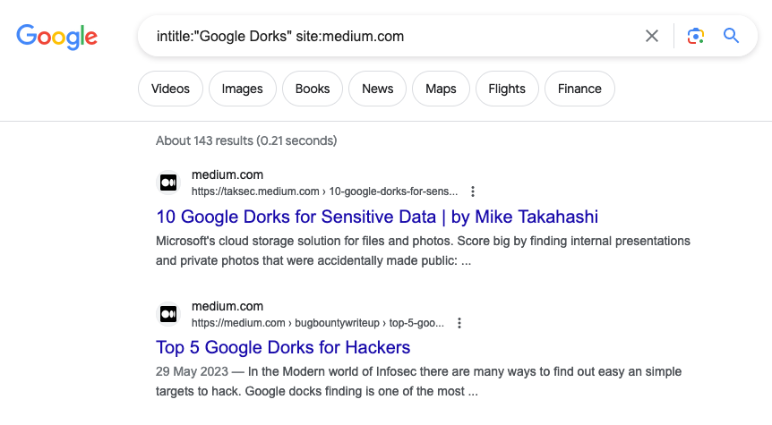

# Google Dorking Playbook




A comprehensive guide to Google Dorking, Search Operators, OSINT Reconnaissance, Research Techniques, and Bug Bounty Discovery.

This repository is designed to help security researchers, bug bounty hunters, students, OSINT analysts, system administrators, and developers leverage Google's advanced search operators effectively.

> **Educational and Defensive Security Purposes Only.**
>
> This repository focuses on lawful reconnaissance, information discovery, OSINT, and search optimization techniques. Users are responsible for complying with applicable laws, platform policies, and bug bounty program rules.

---

## Table of Contents

- Introduction
- What is Google Dorking?
- How Google Search Works
- Search Operator Cheat Sheet
- Operator Combinations
- OSINT Applications
- Bug Bounty Reconnaissance
- Research & Investigation
- Developer Use Cases
- Examples Library
- Dork Generator
- Repository Structure
- Learning Path
- Contributing
- Disclaimer
- License

---

## Introduction

Google indexes billions of publicly accessible webpages, documents, files, images, APIs, and web resources.

Most users only use simple keyword searches.

Google Dorking is the practice of using advanced search operators to narrow search results and discover specific information more efficiently.

Instead of searching:

```text
xyz company reports
```

You can search:

```text
site:example.com filetype:pdf
```

to find only PDF documents from a specific website.

**Google Dorking is widely used in:**

- Open Source Intelligence (OSINT)
- Security Research
- Bug Bounty Reconnaissance
- Digital Investigations
- Academic Research
- Competitive Analysis
- Documentation Discovery
- Asset Enumeration

---

## What is Google Dorking?

Google Dorking (also known as Google Hacking) is the use of advanced Google search operators to identify specific types of information indexed by search engines.

**The technique allows users to:**

- Locate documents
- Discover APIs
- Find public resources
- Identify exposed assets
- Research organizations
- Gather intelligence from public sources

> **Note:** Google Dorking does not bypass authentication or gain unauthorized access. It only works with information that is already publicly indexed by search engines.

---

## How Google Search Works

Google continuously:

1. Crawls websites
2. Follows links
3. Downloads content
4. Indexes discovered information
5. Makes indexed content searchable

```text
Website
   ↓
Google Crawler
   ↓
Google Index
   ↓
Search Results
```

Google Dorking helps refine searches against Google's index.

---

## Search Operator Cheat Sheet

### 1: `site:` Search within a specific website

- **Syntax:** `site:example.com`
- **Example:**

  ```text
  site:xyz.com
  ```

- **Use Cases:** Domain reconnaissance, Content discovery, Asset mapping

### 2: `filetype:` Search for specific file types

- **Syntax:** `filetype:pdf`
- **Example:**

  ```text
  site:example.com filetype:pdf
  ```

- **Finds:** PDFs, DOCX, XLSX, PPTX, TXT etc.

### 3: `inurl:` Search for keywords inside URLs

- **Syntax:** `inurl:admin`
- **Example:**

  ```text
  site:example.com inurl:blog
  ```

- **Use Cases:** Documentation discovery, Portal discovery, Resource mapping

### 4: `intitle:` Search for keywords in page titles

- **Example:**

  ```text
  intitle:"documentation"
  ```

- **Use Cases:** Documentation, Help centers, Public resources

### 5: `allintitle:` Require multiple words in page titles

- **Example:**

  ```text
  allintitle: security report
  ```

### 6: `allinurl:` Require multiple words in URLs

- **Example:**

  ```text
  allinurl: api docs
  ```

### 7: `related:` Find websites related to a domain

- **Example:**

  ```text
  related:example.com
  ```

### 8: `cache:` View Google's cached version of a page

- **Example:**

  ```text
  cache:example.com
  ```

### 9: `before:` Search content published before a date

- **Example:**

  ```text
  site:example.com before:2024-01-01
  ```

### 10: `after:` Search content published after a date

- **Example:**

  ```text
  site:example.com after:2024-01-01
  ```

---

## Operator Combinations

- **Find PDF Documents:**

  ```text
  site:example.com filetype:pdf
  ```

- **Find Public Documentation:**

  ```text
  site:example.com inurl:docs
  ```

- **Find Blog Posts:**

  ```text
  site:example.com inurl:blog
  ```

- **Find Technical Reports:**

  ```text
  site:example.com filetype:pdf report
  ```

- **Find Research Papers:**

  ```text
  site:edu filetype:pdf research
  ```

---

## OSINT Applications

Open Source Intelligence involves collecting information from publicly available sources.

### Organization Research

```text
site:company.com
```

**Goal:**

- Understand company assets
- Discover resources
- Identify public information
- Document Discovery

```text
site:company.com filetype:pdf
```

**Possible Findings:**

- Whitepapers
- Reports
- Manuals
- Public documentation
- Technology Research

```text
site:company.com
```

**Combine findings with:**

- Documentation
- Public repositories
- Technical blogs
- Bug Bounty Reconnaissance

---

Google Dorking is often used during passive reconnaissance.

**Objectives:**

- Discover assets
- Find documentation
- Locate APIs
- Identify public endpoints
- Understand application structure

### Example 1: Find API References

```text
site:target.com inurl:api
```

### Example 2: Find Documentation

```text
site:target.com inurl:docs
```

### Example 3: Find Swagger References

```text
site:target.com swagger
```

### Example 4: Find Developer Portals

```text
site:target.com developer
```

---

## Research & Investigation

Researchers can use advanced operators for:

- **Academic Research:**

  ```text
  site:edu filetype:pdf
  ```

- **Government Research:**

  ```text
  site:gov filetype:pdf
  ```

- **Technical Documentation:**

  ```text
  filetype:pdf user guide
  ```

---

## Developer Use Cases

Developers can use search operators to find:

- Documentation
- SDKs
- API references
- Configuration examples
- Public code examples

**Example:**

```text
site:docs.example.com authentication
```

---

## Examples Library

The repository contains categorized examples inside:

- `Dorks/`
- `Examples/`

**Each example includes:**
Objective, Query, Explanation, Expected Results, Practical Use Cases, Dork Generator

A simple utility that generates commonly used search queries.

**Example Output:**

```text
site:example.com
site:example.com filetype:pdf
site:example.com inurl:api
site:example.com inurl:docs
```

---

## Repository Structure

```text
Google-Dorking-Playbook/
│
├── README.md
├── Dorks/
│   ├── Files.md
│   ├── APIs.md
│   ├── Documentation.md
│   ├── OSINT.md
│   ├── Bug-Bounty.md
│   └── Github-Dorks.md
│
├── Examples/
│   ├── Company-Recon.md
│   ├── Asset-Discovery.md
│   └── Research.md
│
├── Tools/
│   ├── DorkGenerator.py
│   └── CheatSheet.pdf
│
└── Assets/
    ├── images
    └── gifs
```

---

## Learning Path

### 1. Beginner

- Learn basic operators
- Practice site searches
- Practice document discovery

### 2. Intermediate

- Combine operators
- Perform OSINT research
- Create search workflows

### 3. Advanced

- Asset discovery
- Recon automation
- Search optimization techniques

---

## Contributing

Contributions are welcome.

**You can help by:**

- Adding new examples
- Improving explanations
- Fixing inaccuracies
- Creating diagrams
- Developing utilities

> **Before submitting a pull request:**
>
> - Follow repository guidelines
> - Ensure examples remain educational
> - Avoid including sensitive or unauthorized targets

---

## Disclaimer

**This repository is intended solely for educational, research, and authorized security assessment purposes.**

The author does not encourage:

- Unauthorized access
- Privacy violations
- Illegal activity
- Abuse of search engines

Users are solely responsible for their actions and compliance with applicable laws and program policies.

---

## License

MIT License

Copyright (c) 2026

Permission is hereby granted, free of charge, to any person obtaining a copy of this software and associated documentation files to use, copy, modify, merge, publish, distribute, sublicense, and/or sell copies of the Software, subject to the conditions of the MIT License.
